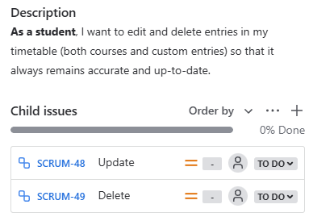

# Course Matrix
## Iteration 01
- **Start date**: 02/04/2025
- **End date**: 02/13/2025

## Process
#### Events
- **Initial planning meeting**:
  - Location: In person, computer lab BV498
  - Time: 2/4/2025
  - Purposes:
    - Go over the sprint 1 requirements
    - Define tasks and responsibilities for each team member
- **Stand up meeting**:
  - Location: Online or in-person depending on members availability
  - Time: Every week Tuesday, Friday and Sunday
  - Purposes
    - Progress updates: What has each member done since the last stand-up
    - Determine the next steps and deadlines
    - Discuss current blockers and possible solutions
- **Final review meeting**
  - Location: Online
  - Time: 2/13/2025
  - Purposes:
    - Review features and deliverables implemented in sprint 1 
    - Determine changes that need to be made in sprint 2
#### Artifacts
- Our team will track the progress through Jira
  - Each user stories will be uploaded to Jira as a ticket:
    - Categorized in the backlog by its epic, and execution sprint
    
    [JIRA Backlog](JIRA_Backlog.png) 
    
    - Tickets details includes: estimated story point to determine its priority, assignees
    
     
    
    - Tickets of large user stories will be broken down to smaller chile issues
    
    
    
    - Each ticket will also show:
      - Other tickets blocked by it
      
      
      
      - Other tickets blocking it
      
      
  
  - Additional tasks required during the development process will also be submitted as a task ticket on JIRA for tracking.
  - Students or groups of student will be assigned first to epic and then to the specific user story.
  - Workflow
  
    

## Product
#### Goal and Tasks
1. Creating database schemas that will be the foundation for feature developments
- **Account database schema**: [SCRUM-67](https://cscc01-course-matrix.atlassian.net/browse/SCRUM-67?atlOrigin=eyJpIjoiNGVjOGU4ZGZkZWMzNDVlYzljZjgxMzNhMGI1Y2MyOGEiLCJwIjoiaiJ9)
- **Course database schema**: [SCRUM-68](https://cscc01-course-matrix.atlassian.net/browse/SCRUM-68?atlOrigin=eyJpIjoiYjg1ZjkxN2IwMzE4NGVlNmE2YmU3YjZlM2ZjNThjZGMiLCJwIjoiaiJ9)
2. Develop product features for the product demo
- **Epic 1: Registration and Login**
  - Account Creation: [SCRUM-25](https://cscc01-course-matrix.atlassian.net/browse/SCRUM-25?atlOrigin=eyJpIjoiNTU0NWE3OTQ3MjgwNDYwNzgzNTM5MjI2NmFjMDc4ZWMiLCJwIjoiaiJ9)
  - Account Login: [SCRUM-26](https://cscc01-course-matrix.atlassian.net/browse/SCRUM-26?atlOrigin=eyJpIjoiMmRkZWQyMjQzMDhlNDQ5MGEwNTRjYjBhMDM2ZDE5YjUiLCJwIjoiaiJ9)
  - Account Logout: [SCRUM-27](https://cscc01-course-matrix.atlassian.net/browse/SCRUM-27?atlOrigin=eyJpIjoiYmY4ZmExZTZmN2VkNGViZTkzNDA4ZjZhZTJlMWE0YTciLCJwIjoiaiJ9)
  - Account Deletion: [SCRUM-28](https://cscc01-course-matrix.atlassian.net/browse/SCRUM-28?atlOrigin=eyJpIjoiODc0ZjQ3MTE3ZGViNGFhZWJiMmYzMTdlZjM0MWM2NjUiLCJwIjoiaiJ9)
- **Epic 2: Course DB**
  - Courses List Display: [SCRUM-42](https://cscc01-course-matrix.atlassian.net/browse/SCRUM-42?atlOrigin=eyJpIjoiYTMzZWI2OGQxYmUyNDc2MmE4MTM5ZjA2M2I3NWFmYWUiLCJwIjoiaiJ9)
  - Courses Entries Display: [SCRUM-43](https://cscc01-course-matrix.atlassian.net/browse/SCRUM-43?atlOrigin=eyJpIjoiYzIxMTdkN2ZkYjc3NGU1NWJhNTAxZDE3ODA4NTM2ZmIiLCJwIjoiaiJ9)
- **Epic 3: Scheduler**
  - Timetable Basic/Insertion: [SCRUM-46](https://cscc01-course-matrix.atlassian.net/browse/SCRUM-46?atlOrigin=eyJpIjoiN2Y1NTgzNzQ2MGZjNGYyZjgwOTdhNDM0ZjE5MjIzOWIiLCJwIjoiaiJ9)
  - Entries Update/Delete: [SCRUM-47](https://cscc01-course-matrix.atlassian.net/browse/SCRUM-47?atlOrigin=eyJpIjoiN2JiYmY1NTdjNDNlNGE2MzhlM2NkODhiYjFiOGYwYmEiLCJwIjoiaiJ9)
3. Creating sprint1 documentation: [SCRUM-70](https://cscc01-course-matrix.atlassian.net/browse/SCRUM-70?atlOrigin=eyJpIjoiNGE5YWQ3MzU5YTg3NGI1ODgyNjk2YTBlOWY4ZDgzMDkiLCJwIjoiaiJ9)
#### Artifacts
1. Database Schemas
- Courses schema:
  - Course table: Course information
  - Offerings table: Lecture sections availabled for each course in a semester
- Account schema
  - Users
  - Event
2. Pages/Features
- Registration and login
  - Static welcome page for users to create an account
  - Static welcome page for users to login to their account
  - Drop down button for users to logout of their account
  - Static page for users to delete their account
- Course DB
  - Static page that display all the courses available, with filter options for users to narrow it down
  - Static course page that display detailed course information
- Scheduler
  - Dynamic page containing a calender that allows users to add, edit and delete event entries
  