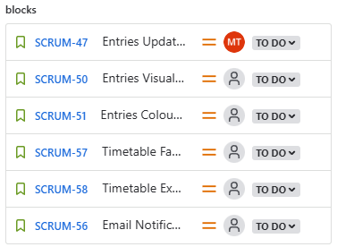

# Course Matrix
## Iteration 01
- **Start date**: 02/04/2025
- **End date**: 02/13/2025

## 1. Process
#### 1.1 Roles & Responsibilities
- **Epic 1: Registration/Login**: Thomas and Masa
  - Create account database schema to store and protect users' account information
  - Develop software backend API and frontend UI to handle users' account registrations and authentications to ensure secured access to different pages

- **Epic 2: Course Database**: Kevin and Austin
  - Create a course database schema to store all course offerings and course information
  - Develop software backend API and frontend UI to display all courses and course offerings information

- **Note taking & Documentation**: Minh
  - Taking notes during stand-ups
  - Create sprint 1 documentation: iteration-plan-01, RPM, and sprint-01 review
  - Create System Design Document

In addition to their specific roles, all team members have a collective responsibility to support and assist other team members to ensure that the goals (listed in section 2.1 ) are achieved and develop a working prototype.

#### 1.2 Events
- **Initial planning meeting**:
  - Location: In person, computer lab BV498
  - Time: 2/4/2025
  - Purposes:
    - Go over the sprint 1 requirements
    - Define tasks and responsibilities for each team member

- **Stand up meeting**:
  - Location: Online or in-person depending on members availability
  - Time: Every Tuesday 12 pm to 1 pm, Friday and Sunday from 9 pm to 10 pm
  - Purposes
    - Progress updates: What has each member done since the last stand-up
    - Determine the next steps and deadlines
    - Discuss current blockers and possible solutions

- **Final review meeting**
  - Location: Online
  - Time: 2/13/2025
  - Purposes:
    - Review features and deliverables implemented in sprint 1 
    - Determine changes that need to be made in sprint 2

#### 1.3 Artifacts
- Our team will track the progress through Jira
  - Each user story will be uploaded to Jira as a ticket:
    - Categorized in the backlog by its epic, and execution sprint
    
    
    
    - Ticket details include: estimated story point to determine its priority, assignees
    
    
    
    - Tickets of large user stories will be broken down into smaller child issues
    
    
    
    - Each ticket will also show:
      - Other tickets blocked by it
      
      
      
      - Other tickets blocking it
      
      
      
  - Additional tasks required during the development process will also be submitted as a task ticket on JIRA for tracking.
  - Students or groups of students will be assigned first to epic and then to the specific user story.
  - Workflow
  
  

## 2. Product
#### 2.1 Goal and Tasks
**1. Create database schemas that will be the foundation for future feature developments**
  - *Account database schema*: [SCRUM-67](https://cscc01-course-matrix.atlassian.net/browse/SCRUM-67?atlOrigin=eyJpIjoiNGVjOGU4ZGZkZWMzNDVlYzljZjgxMzNhMGI1Y2MyOGEiLCJwIjoiaiJ9)
  - *Course database schema*: [SCRUM-68](https://cscc01-course-matrix.atlassian.net/browse/SCRUM-68?atlOrigin=eyJpIjoiYjg1ZjkxN2IwMzE4NGVlNmE2YmU3YjZlM2ZjNThjZGMiLCJwIjoiaiJ9)

**2. Develop product features for the product demo:**
  - *Epic 1: Registration and Login*
    - Account Creation: [SCRUM-25](https://cscc01-course-matrix.atlassian.net/browse/SCRUM-25?atlOrigin=eyJpIjoiNTU0NWE3OTQ3MjgwNDYwNzgzNTM5MjI2NmFjMDc4ZWMiLCJwIjoiaiJ9)
    - Account Login: [SCRUM-26](https://cscc01-course-matrix.atlassian.net/browse/SCRUM-26?atlOrigin=eyJpIjoiMmRkZWQyMjQzMDhlNDQ5MGEwNTRjYjBhMDM2ZDE5YjUiLCJwIjoiaiJ9)
    - Account Logout: [SCRUM-27](https://cscc01-course-matrix.atlassian.net/browse/SCRUM-27?atlOrigin=eyJpIjoiYmY4ZmExZTZmN2VkNGViZTkzNDA4ZjZhZTJlMWE0YTciLCJwIjoiaiJ9)

  - *Epic 2: Course DB*
    - Courses List Display: [SCRUM-42](https://cscc01-course-matrix.atlassian.net/browse/SCRUM-42?atlOrigin=eyJpIjoiYTMzZWI2OGQxYmUyNDc2MmE4MTM5ZjA2M2I3NWFmYWUiLCJwIjoiaiJ9)
    - Courses Entries Display: [SCRUM-43](https://cscc01-course-matrix.atlassian.net/browse/SCRUM-43?atlOrigin=eyJpIjoiYzIxMTdkN2ZkYjc3NGU1NWJhNTAxZDE3ODA4NTM2ZmIiLCJwIjoiaiJ9)

**3. Create sprint1 documentation:** [SCRUM-70](https://cscc01-course-matrix.atlassian.net/browse/SCRUM-70?atlOrigin=eyJpIjoiNGE5YWQ3MzU5YTg3NGI1ODgyNjk2YTBlOWY4ZDgzMDkiLCJwIjoiaiJ9)

#### 2.2 Artifacts
**1. Database Schemas**
  - Courses schema:
    - Course table: Course information
    - Offerings table: Lecture sections available for each course in a semester
    - Prerequisite table: Records prerequisite relationships
    - Corequisite table: Records corequisite relationships 

    
  - Account schema
    - Users
    - Event

**2. Pages/Features**
  - Registration and login
    - Static welcome page for users to create an account
    - Static welcome page for users to log in to their account
    - Drop-down button for users to log off their account
  
  - Course DB
    - Static page that displays all the courses available, with filter options for users to narrow it down
    - Static course page that displays detailed course information

**3. Mock data**
  - Mock data for courses & offerings extracted from UTSC course timetable archive for Winter, Summer, Fall 2024.
