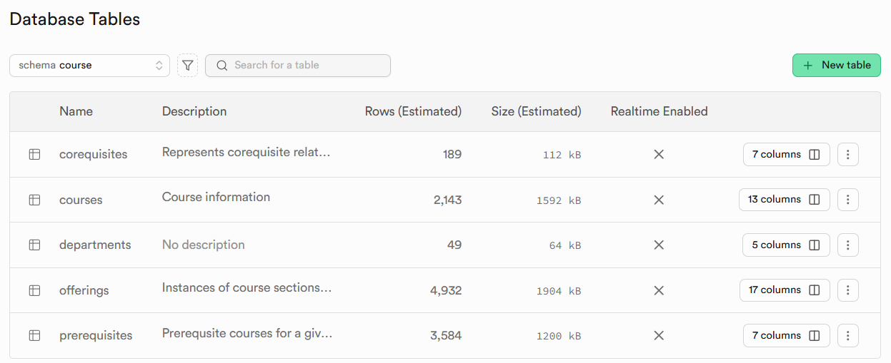
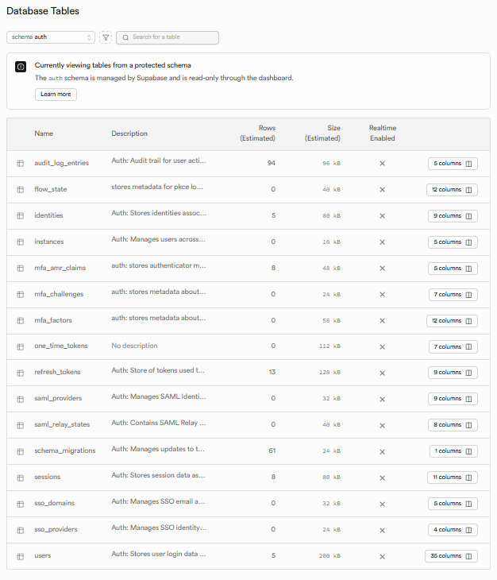
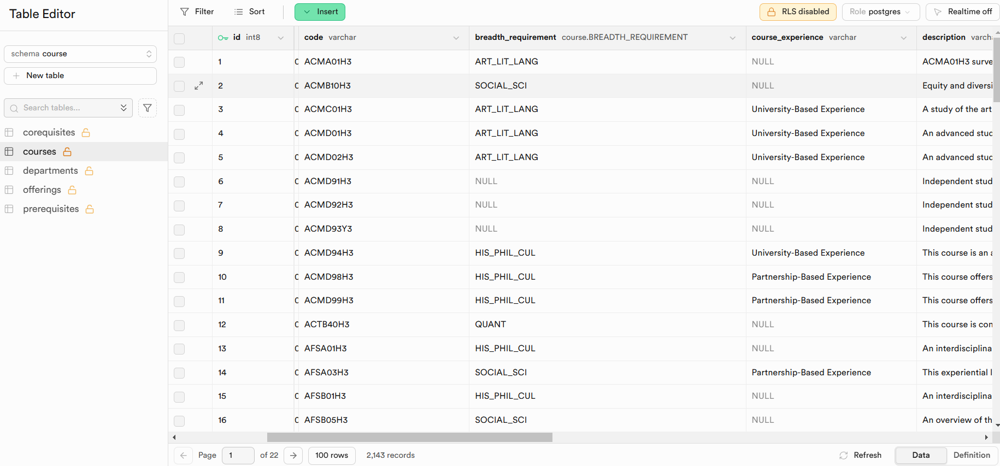
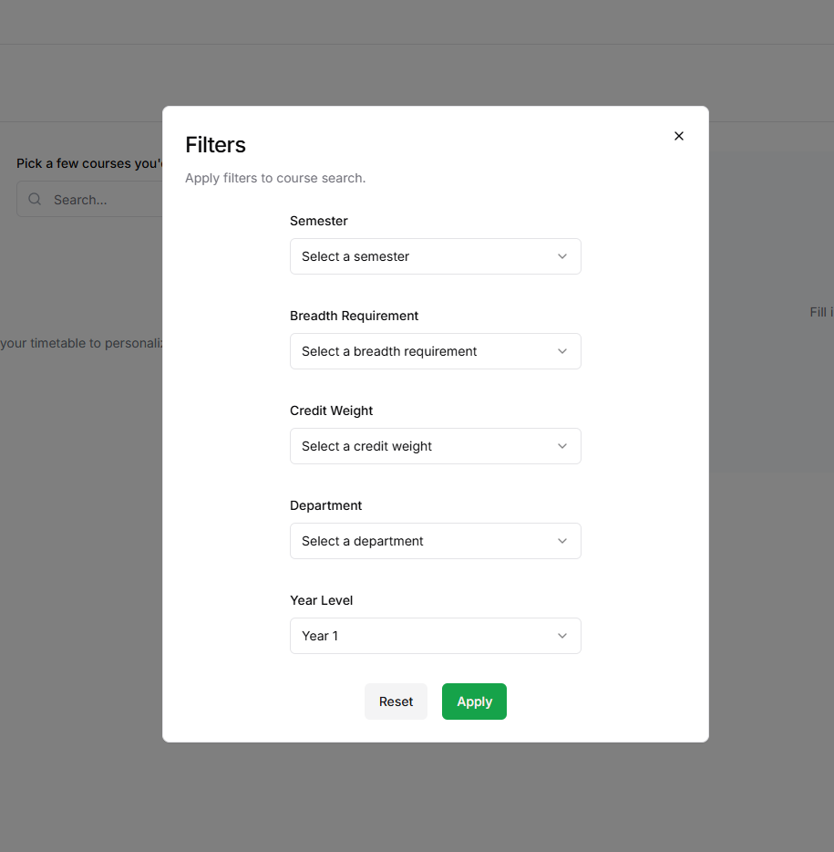

# Course Matrix/term-group-project-c01w25-project-course-matrix

## Iteration 01 - Review & Retrospect
When: 2/13/2025 at 9:00 pm 
Where: Online

## Process - Reflection
In Sprint 1, our team focused on developing the critical features needed to establish a foundational software and database structure, which will be further enhanced in future sprints.
Our team successfully generated two database schemas:
- A `course` schema for storing course and course-offering information
- A `auth` schema for storing user account information

Both schemas were populated with data from previous semesters, serving as mock data. Additionally, we implemented account registration, login, and logout functionality to ensure that only authorized users can access Course Matrix features and protected database content.
Furthermore, we laid the foundation for a timetable generator by enabling users to browse and filter the course database to find relevant courses and lectures. We also introduced options for users to apply specific restrictions to their schedules.
### Decision that turned out well
1. **Pair Programming & Peer Evaluation**
Our team adopted a pair programming approach, where each member was paired with another to provide support and review submissions. This approach worked well, as it allowed us to complete all planned tasks despite each member's busy schedule with midterms and other assignments.

2. **Balanced User Story Planning**
The number of user stories planned for Sprint 1 factored in scheduling constraints. Allocating story points helped us prioritize tasks effectively, ensuring all features and components were thoroughly tested and functional without overburdening any team member.

3. **Sub Tasks For Large User Story** 
At the start of Sprint 1, we spent time breaking down complex user stories into smaller, specific tasks. This approach provided clearer instruction and expectations for each member's deliverables, reducing the time needed for testing and integrating components.

4. **Using Supabase**
We opted to use Supabase, which offered intuitive coding guidelines, built-in tools that sped up the implementation process, seamless integration with our tech stack and provide a user-friendly interface.
### Decision that did not turn out as well as we hoped
1. **Intermediate Deadline & Check-ins**
Although we had well-defined goals and met our final deadline, intermediate deadlines and check-ins could have been better planned. This would have helped identify and resolve errors earlier in the development process and ensure that all team members delivered the expected progress at each check-in.

### Planned Changes
**Improve Code Comment/Documentation**: At the beginning of each component, add a comment block explaining its functionality and connections to other components if applicable.

**Standardizing Code Formating**: Aligning coding conventions across the project to ensure consistency (to be documented in the README.md)

## Produce - Review
### Goals and/or tasks that were met/completed
- Build database schemas to store course information, course offerings and user accounts by Feb 9th 2025
  - `courseschema`:
    - The `offerings` table should have columns for the Meeting Section, Session Offering, Day of Week, Start-End time, Location, Number of current enrollments, Max number of enrollments, Instructor
    - The `courses` table should have columns for the course code, name, breadth requirements, description, prerequisites, corequisites, and exclusions
    - The `corequisites` table should have columns to map each course_id with their corresponding corequisite course_ids
    - The `prerequisites` table should have columns to map each course_id with their corresponding prerequisite course_ids
    - The `departments` table should have columns to map each department to their code name as shown in the course codes
  
  

  - `account` schema (renamed: `auth` schema) :
    - The `users` table should have columns to store user account information: email, encrypted password, user_id
  
  
   
- Import course information and course offerings for the Winter, Summer and Fall semesters of 2024 from the UTSC timetable archive by Feb 9th 2025 as a mock database for courses offered in the Fall, Summer semester of 2025 and Winter of 2026.

- Build basic software features for the first TA demo by Feb 13th 2025 including:
  - Account registration, login, logout
  - Display all available courses with filtering options:
    - Semester
    - Breadth Requirement
    - Credit Weight
    - Department
    - Course Level

- Display courses and course offerings information: Course Description, Meeting Section, Offering, Days of Week, Time, Location

### Goals and/or tasks that were planned but not met/completed
- None

## Meeting Highlights
For the next iteration, development efforts will focus on:

1. Course Calendar Customization
  - Adding, updating and deleting personal events
  - Adding and removing courses
  - Color-coding events
2. AI Assistant Integration
3. Timetable Builder Algorithm Development
4. Process Enhancements
  - Improving intermediate check0ins
  - Strengthening coding conventions
  - Enhancing code documentation with comments