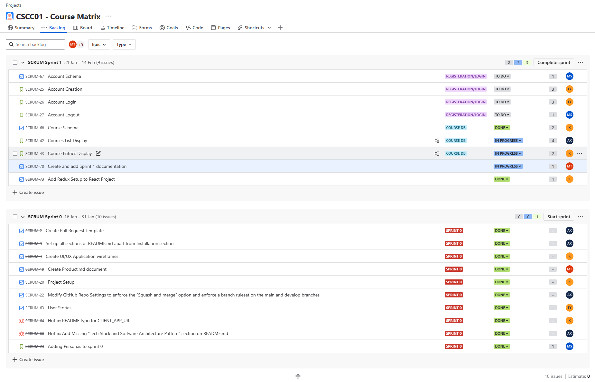

# Course Matrix

## Iteration 01

- **Start date**: 02/15/2025
- **End date**: 03/07/2025

## 1. Process

### 1.1 Roles & Responsibilities

#### Epic 1: Scheduler

**Team Members:** Austin, Minh, Thomas

- Develop a calendar interface that allows users to add, modify, and delete both custom entries and predefined course entries.
- Implement an algorithm that optimally schedules events based on user preferences and constraints.

#### Epic 2: AI Assistant

**Team Members:** Kevin, Masa

- Develop an AI-powered chat interface that enables direct Q&A interactions between users and the AI.
- Ensure seamless integration with the scheduling system to provide intelligent recommendations and assistance.

- **Note taking & Documentation**: Minh and Thomas
  - Taking notes during stand-ups
  - Create sprint 2 documentation: iteration-plan-02, RPM, and sprint-02 review
  - Update System Design Document

In addition to their specific roles, all team members have a collective responsibility to support and assist other team members to ensure that the goals (listed in section 2.1) are achieved and develop a working prototype.

#### 1.2 Events

- **Initial planning meeting**:

  - Location: Virtual
  - Time: 2/16/2025
  - Purposes:
    - Go over the sprint 2 requirements
    - Define tasks and responsibilities for each team member

- **Stand up meeting**:

  - Location: Online or in-person depending on members availability
  - Time: Every Tuesday from 12 pm to 1 pm, Friday and Sunday from 9 pm to 10 pm
  - Purposes
    - Progress updates: What has each member done since the last stand-up
    - Determine the next steps and deadlines
    - Discuss current blockers and possible solutions

- **Final review meeting**
  - Location: Online
  - Time: 3/6/2025
  - Purposes:
    - Review features and deliverables implemented in sprint 2
    - Determine changes that need to be made in sprint 3

#### 1.3 Artifacts

- Our team will track the progress through Jira

  - Each user story will be uploaded to Jira as a ticket:

    - Categorized in the backlog by its epic, and execution sprint

    

    - Ticket details include: estimated story point to determine its priority, assignees

    

    - Tickets of large user stories will be broken down into smaller child issues

    

    - Each ticket will also show:

      - Other tickets blocked by it

      

      - Other tickets blocking it

      

  - Additional tasks required during the development process will also be submitted as a task ticket on JIRA for tracking.
  - Students or groups of students will be assigned first to epic and then to the specific user story.
  - Workflow

  

## 2. Product

#### 2.1 Goal and Tasks

**1. Develop product features for the product demo:**

- _Account Editing_: [SCRUM-95](https://cscc01-course-matrix.atlassian.net/jira/software/projects/SCRUM/boards/1/backlog?selectedIssue=SCRUM-95)
- _Account Deletion_: [SCRUM-28](https://cscc01-course-matrix.atlassian.net/jira/software/projects/SCRUM/boards/1/backlog?selectedIssue=SCRUM-28)

- _Epic 1: Scheduler_

  - Timetable Basics/Insertion: [SCRUM-46](https://cscc01-course-matrix.atlassian.net/browse/SCRUM-46)
  - Entries Update/Delete: [SCRUM-47](https://cscc01-course-matrix.atlassian.net/browse/SCRUM-47)
  - Timetable Generation: [SCRUM-52](https://cscc01-course-matrix.atlassian.net/browse/SCRUM-52)
  - Entries Visualization: [SCRUM-50](https://cscc01-course-matrix.atlassian.net/browse/SCRUM-50)
  - Entries Colour Customization: [SCRUM-51](https://cscc01-course-matrix.atlassian.net/browse/SCRUM-51)
  - Timetable Favourite: [SCRUM-57](https://cscc01-course-matrix.atlassian.net/browse/SCRUM-57)

- _Epic 2: AI Assistant_
  - Creation of New Chats: [SCRUM-36](https://cscc01-course-matrix.atlassian.net/browse/SCRUM-36)
  - Chatlog Export/Rename/Delete: [SCRUM-37](https://cscc01-course-matrix.atlassian.net/browse/SCRUM-37)
  - Course Info Retrieval: [SCRUM-29](https://cscc01-course-matrix.atlassian.net/browse/SCRUM-29)
  - Program Requirements Retrieval: [SCRUM-30](https://cscc01-course-matrix.atlassian.net/browse/SCRUM-30)

**3. Create sprint2 documentation:** [SCRUM-119](https://cscc01-course-matrix.atlassian.net/browse/SCRUM-119)

#### 2.2 Artifacts

### Pages/Features

#### Registration/Login

- Dropdown menu displaying username and associated email.
- Functional password reset and account deletion features.

#### Scheduler

- Home page for creating new timetables.
- Timetable management: insertion, updating, and deletion of both course entries and custom user entries.
- Algorithm for automated timetable generation.
- Hover effect: calendar highlights selected course entry.
- Custom colour selection for timetable entries.
- Option to favourite timetables for quick access.

#### AI Assistant

- Functional AI chatbot interface with chat log creation, editing, and deletion.
- AI retrieves relevant course information and program requirements from the course database.
- AI strictly uses the internal course database without relying on external or irrelevant information.
