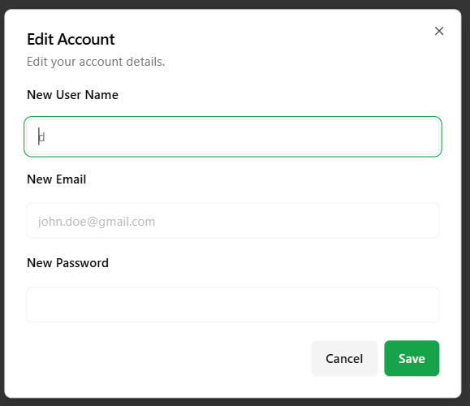

# Course Matrix/term-group-project-c01w25-project-course-matrix

## Iteration 02 - Review & Retrospect

When: 3/6/2025 at 9:00 pm
Where: Online

## Process - Reflection

In Sprint 2, our team focused on developing our most complex and difficult features needed to establish our software’s main functionality, which will be completed and tested in future sprints.
Our team successfully generated and implemented the following features:

- AI assistant chatbot to help query useful information regarding courses and prerequisites.
- Timetable display, a better calendar visualizer.
- Deploying a functional version of our software.
- Editing and updating accounts.
- Improving documentation for code.
- Resolving bug issues from previous sprints.

By the end of sprint 2 we were able to have most of these features completed and for the features that weren’t completed excellent progress has been made into completing them.

We have set up an AI assistant that can answer questions related to course offerings. Multiple chats can be created, and deleted. These chats can be copied to clipboard and exported wherever the user sees fit. We have completed functionality for users, they can now update and delete their accounts. The timetable, our main feature, has all of its infrastructure setup and is well in progress to being completed.

The setup for deploying our application has been completed, with a basic version of our application already deployed on google cloud. Our code’s readability and format has also been standardized so that all functions pushed are well documented.

In conclusion, during sprint 2 excellent progress has been made in completing our software’s main features.

#### Decision that turned out well

1. **Using AI Frameworks**
   One of the decisions that turned out well for our group was using various AI tools (Langchain, assistant-ui, Pinecone, OpenAI). The usage of these tools was extremely helpful in refining our AI chatbot’s replies. Additionally, these open source softwares were able to accelerate our development time letting us get our work completed faster.

2. **Division of Tasks Based on Expertise**
   We divided the work among our group members depending on what they had worked on in the previous sprint. For instance, our people who had worked on the basics of fetching the courses worked on it again. This allowed them to build on their previous experience and get their work completed faster. For our AI chatbot we had a member currently going through CSCC11 introduction to machine learning. The course provided experience helped them complete the feature more quickly as well.

3. **Schedule-X UI Library**
   This provided a nice visual interface for displaying the user’s timetables as well as an easy way of managing them (e.g. supports drag-and-drop functionality). Due to this choice we were able to quickly get a visually appealing UI for our application.

#### Decision that did not turn out as well as we hoped

1. **Amount of User Stories to Complete**
   During sprint 2 we had hoped on completing most of our user stories by the end due to the presence of reading week. We believed that due to this we could complete nearly the entirety of our application. We were incorrect as there were many critical points that needed to be completed before moving on to other features meaning most of the user stories we wanted to complete by sprint 2 had to be pushed back to sprint 3.

2. **Incorrect Estimation of User Story Difficulty**
   During sprint 2 we underestimated the difficulty of many of the user stories to be completed. Many of the user stories we labeled as having story points of 5, which in retrospect was clearly too low.

#### Planned Changes

**Pushing Back Various User Stories**
Due to the underestimation of the difficulty of getting various user stories completed we will be pushing back multiple user stories and features to the next sprint.

**Work Periods**
Work periods proved to be an excellent addition to our group’s productivity. These work periods allowed all of our members to work cooperatively to get tasks done quicker.

## Produce - Review

#### Goals and/or tasks that were met/completed

- Set up Custom SMTP for Supbase email sending (https://cscc01-course-matrix.atlassian.net/browse/SCRUM-94).

- Improve documentation for Sprint 1 code (https://cscc01-course-matrix.atlassian.net/browse/SCRUM-105). During the course of Sprint 2 we documented all of our code from sprint 1. Now every function and file is documented such that it is clear what it does, what information it takes, and where it is used.

- Setup GitHub Workflow to auto-format code (https://cscc01-course-matrix.atlassian.net/browse/SCRUM-107). Whenever code is committed to git it is automatically made to conform to a specified format.

- Account Editing (https://cscc01-course-matrix.atlassian.net/browse/SCRUM-95). The user can now edit their account from our `auth\users\` table such that they can change their username and password as they please. The user can change their username to anything they want so long as it is not blank nor over 50 characters long and their password can be changed via email confirmation.
  
- Account Deletion (https://cscc01-course-matrix.atlassian.net/browse/SCRUM-28). The user can now delete their account from our `auth\users\` table such that all information regarding the account is deleted as well.
  

- Course Info Retrieval (https://cscc01-course-matrix.atlassian.net/browse/SCRUM-29). The user can now query the chatbot for information about the course information from our `courses` table (e.g. CSCC01 Intro to Software Engineering is a computer science course that teaches the basics of software engineering and requires CSCB09).
- Program Requirements Retrieval (https://cscc01-course-matrix.atlassian.net/browse/SCRUM-30). The ability for our user to ask our AI chatbot for a course’s program requirements from our `courses` table.

- Create Deployment Plan (https://cscc01-course-matrix.atlassian.net/browse/SCRUM-108). Our application will be deployed using a google cloud virtual machine, currently a basic version of our application is deployed in the following address: http://34.130.253.243:5173

- AI Infrastructure (https://cscc01-course-matrix.atlassian.net/browse/SCRUM-109). We have created and trained a chatbot AI using an OpenAI token so a user can query it for course information from our database and respond accordingly.

- Creation of New Chats (https://cscc01-course-matrix.atlassian.net/browse/SCRUM-36). The ability for a user to have multiple chats with our AI chatbot.

- Chatlog Export/Name/Delete
  (https://cscc01-course-matrix.atlassian.net/browse/SCRUM-37). The ability for our user to name, export and delete their chats with our AI chatbot.

- Sprint 2 Documentation (https://cscc01-course-matrix.atlassian.net/browse/SCRUM-119). During sprint 2 all of our code was documented and formatted properly. All added functions and files have clearly defined uses and required fields.

- Fix: Password max Length (https://cscc01-course-matrix.atlassian.net/browse/SCRUM-112). Made sure that password lengths would not exceed 50 characters.

- Enable RLS (https://cscc01-course-matrix.atlassian.net/browse/SCRUM-113). Made it so that only admin level access could edit and modify user information.

- Fix: Redirect login to dashboard if session exists (https://cscc01-course-matrix.atlassian.net/browse/SCRUM-114). User is redirected to the login page automatically if a session is not found.

- Fix: Improve auth middleware logic to check user session (https://cscc01-course-matrix.atlassian.net/browse/SCRUM-117).

- Fix: Auth Session Infinite loop (https://cscc01-course-matrix.atlassian.net/browse/SCRUM-118). Fixed potentially issue where Auth might trap users in an infinite loop.

#### Goals and/or tasks that were planned but not met/completed

- Timetable Basics/Insertion (https://cscc01-course-matrix.atlassian.net/browse/SCRUM-46). The ability for a user to add courses from our `courses` table to their timetables and display it in a visually useful format.

- Entries Update/Delete (https://cscc01-course-matrix.atlassian.net/browse/SCRUM-47). The ability to update an entry’s information for instance, a course’s lecture time from our `courses` table. The ability to change a user’s timetable for different courses.

- Timetable Generation (https://cscc01-course-matrix.atlassian.net/browse/SCRUM-52). The ability for a user to automatically generate a timetable with a given selection of courses from our `courses` table and time requirements.

## Meeting Highlights

We have decided to do the following from here on out:
Better estimate user story points
Designate work periods

For the next meetings our development efforts will focus on:
Refining our AI Chatbot
Completing the timetable
Reassess our user stories
Fully Deploying our Application
