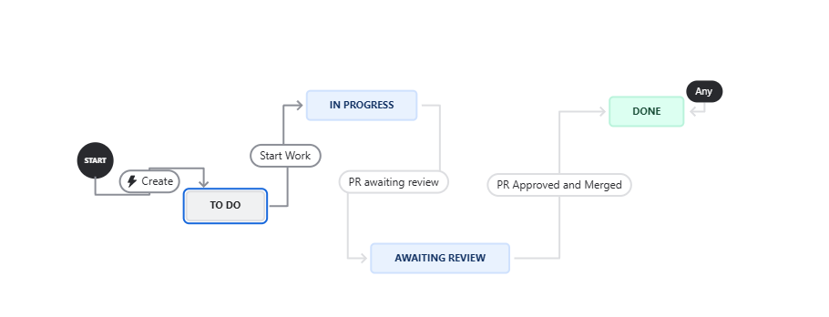

# Course Matrix

## Iteration 04

- **Start date**: 03/21/2025
- **End date**: 04/04/2025

## 1. Process

### 1.1 Roles & Responsibilities

#### Epic 1: Scheduler

**Team Members:** Austin, Minh, and Thomas

- Develop a calendar interface that allows users to favourite their calendars.
- Develop an interface that allows users to share their calendars with one another.
- Develop an algorithm that allows users to compare two different timetables together.

#### Epic 2: AI Assistant

**Team Members:** Kevin

- Develop an AI-powered chat interface that can create, delete, and show user timetables.
- Refine AI-powered chat interface so that querying for database information is more reliable and understandable

- **Note taking & Documentation**: Minh, Masahisa, and Thomas
  - Taking notes during stand-ups
  - Create sprint 4 documentation: iteration-plan-04, RPM, and sprint-04 review
  - Update System Design Document

In addition to their specific roles, all team members have a collective responsibility to support and assist other team members to ensure that the goals (listed in section 2.1) are achieved and develop a working prototype.

#### Epic 3: Deployment

**Team Members:** Masahisa

- Create a dockerfile such that our application can be run on a docker image with application setup being done automatically.
- Ensure that our application’s docker image runs on a VM instance accessible on the web.
- Ensure that our deployed project automatically redeploys when a new version of our application is pushed that passes all unit testing.
- Ensure that our application images are stored on dockerhub with a version tag and a master branch holding the latest version.

#### Epic 4: Unit Testing

**Team Members:** Austin, Minh, Thomas, Kevin

- Create unit tests for our application functions (timetable, ai assistant, user stories, etc.) such that their functionality is clear and bug free.

#### 1.2 Events

- **Initial planning meeting**:

  - Location: Virtual
  - Time: 3/22/2025
  - Purposes:
    - Go over the sprint 4 requirements
    - Define tasks and responsibilities for each team member

- **Stand up meeting**:

  - Location: Online or in-person depending on members availability
  - Time: Every Tuesday from 12 pm to 1 pm, Thursday and Sunday from 9 pm to 10 pm
  - Purposes
    - Progress updates: What has each member done since the last stand-up
    - Determine the next steps and deadlines
    - Discuss current blockers and possible solutions

- **Final review meeting**
  - Location: Online
  - Time: 4/04/2025
  - Purposes:
    - Review features and deliverables implemented in sprint 4
    - Determine changes that need to be made in sprint 4

#### 1.3 Artifacts

- Our team will track the progress through Jira

  - Each user story will be uploaded to Jira as a ticket:

    - Categorized in the backlog by its epic, and execution sprint

    

    - Ticket details include: estimated story point to determine its priority, assignees

    

    - Tickets of large user stories will be broken down into smaller child issues

    

    - Each ticket will also show:

      - Other tickets blocked by it

      

      - Other tickets blocking it

      

  - Additional tasks required during the development process will also be submitted as a task ticket on JIRA for tracking.
  - Students or groups of students will be assigned first to epic and then to the specific user story.
  - Workflow

  

- Furthermore, we will implement a Burndown Chart, which will be included as `burndown.pdf` by the end of the sprint. This chart will also feature comments on the sprint's progress and a velocity comparison.
- Below is an example Burndown Chart from Sprint 0:

## 2. Product

#### 2.1 Goal and Tasks

**1. Develop product features for the product demo:**

- _Epic 1: Scheduler_

  - Timetable Compare: [SCRUM-62](https://cscc01-course-matrix.atlassian.net/browse/SCRUM-62)
  - Timetable Favourite: [SCRUM-57](https://cscc01-course-matrix.atlassian.net/browse/SCRUM-57)
  - Timetable Export/Share:
    [SCRUM-58](https://cscc01-course-matrix.atlassian.net/browse/SCRUM-58)

- _Epic 2: AI Assistant_

  - Delete confirmation for chatbot:
    [SCRUM-148](https://cscc01-course-matrix.atlassian.net/browse/SCRUM-148)
  - Prevent Chatbot from creating more than 1 timetable at once:
    [SCRUM-149](https://cscc01-course-matrix.atlassian.net/browse/SCRUM-149)

- _Epic 3: CI/CD Pipeline_
  - Project Deployment:
    [SCRUM-130](https://cscc01-course-matrix.atlassian.net/browse/SCRUM-130)
  - Assignment 2 Completion: [SCRUM-163](https://cscc01-course-matrix.atlassian.net/browse/SCRUM-163)

**3. Create sprint 4 documentation:**
[SCRUM-176](https://cscc01-course-matrix.atlassian.net/browse/SCRUM-176)

#### 2.2 Artifacts

### Pages/Features

#### Scheduler

- Option to favourite timetables for quick access.
- Option to share/export timetable to other users
- Option to compare two separate timetables
- Enhance frontend UI to be more usable

#### AI Assistant

- Ability to generate, delete, create, view timetables and more using AI chatbot
- Deleting anything with chatbot must only be done after another user confirmation
